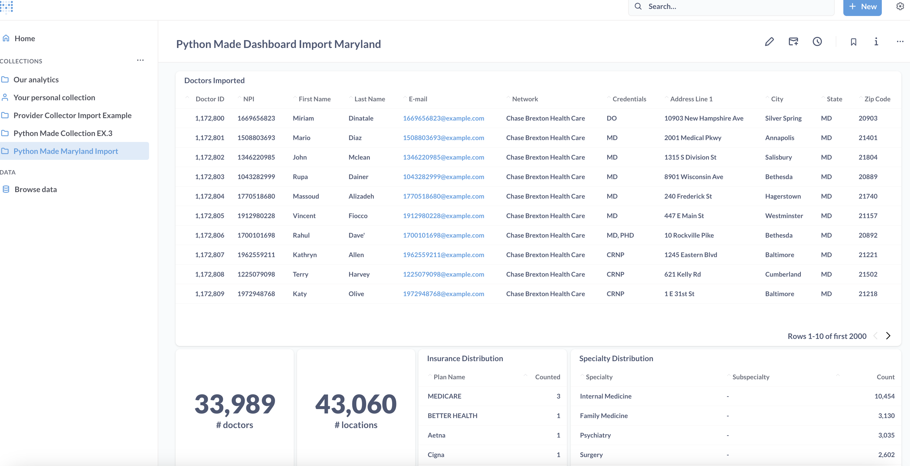

# Metabase Dashboard Automation

This Python script automates the creation of a dashboard in Metabase along with its associated collections and cards. The dashboard contains visualizations and data insights related to imported data from Maryland.

### Setup

1. Ensure you have Python installed on your system.

2. Install the requests library by running:

        pip install requests

3. Create a Metabase Account and get an API token

4. Connect a Database from your local

5. Replace placeholders in the script:

    - BASE_URL: Replace with the URL of your Metabase instance.
    - API_KEY: Replace with your Metabase API key.
    - IMPORT_NAME: Replace with the dynamic name of the import for the queries
    
6. Update database IDs and queries for what you want to display

### Running the program

        python app.py

### Features
- Collection Creation: Creates a collection for the dashboard.
- Dashboard Creation: Creates a dashboard and associates it with the collection.
- Card Creation: Creates various cards with different visualizations and insights:
- Map Visualization: Displays providers on a map.
- Scalar Cards: Show counts of doctors and locations.
- Table Visualizations: Provide insights on doctors, insurance distribution, specialty distribution, and summary.

### Display
